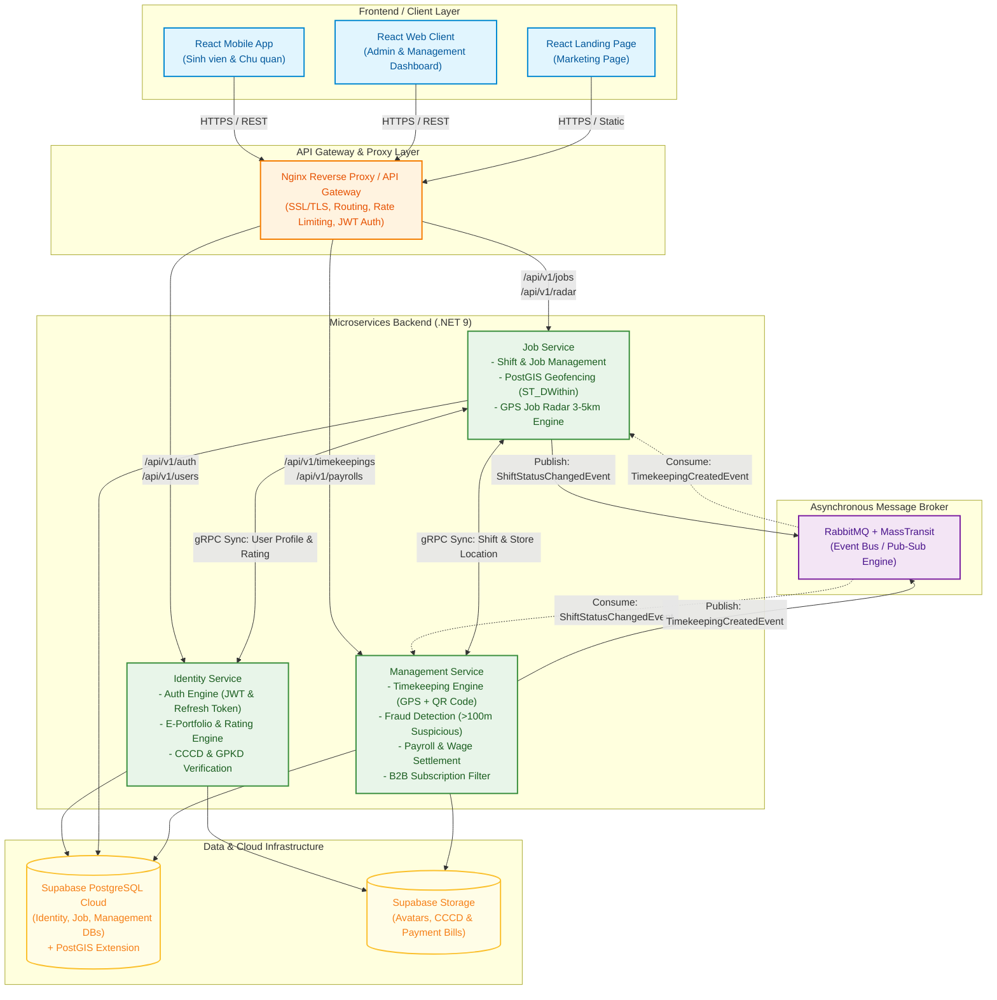
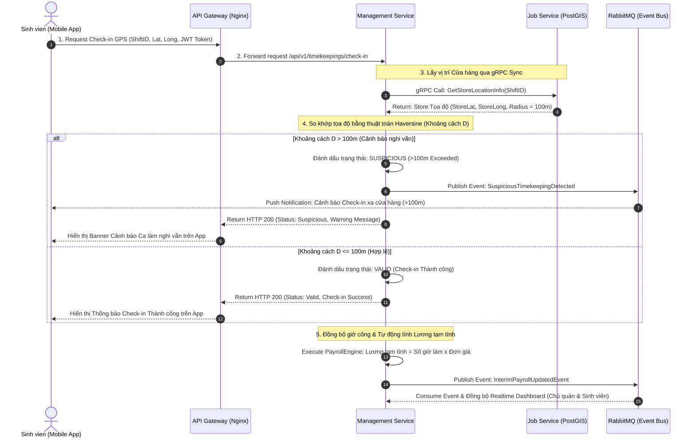
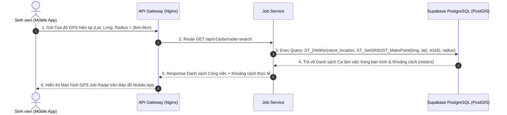
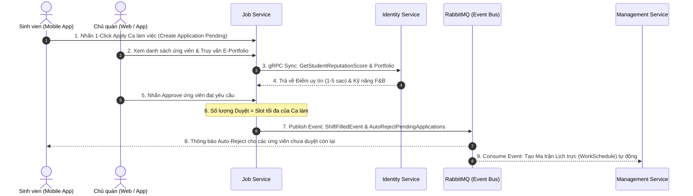

# 3. OUTCOME 1: SẢN PHẨM MVP, TIẾN ĐỘ & KIẾN TRÚC KỸ THUẬT

## 3.1. Khai báo Nền tảng Triển khai (Deployment Platform)
*(Đánh dấu [X] vào hình thức triển khai thực tế của nhóm làm căn cứ tính khung điểm tối đa)*:

*   [ ] **CH Play / App Store Deployment** *(Thang điểm đánh giá tối đa: 10.0đ)*:
    *   Link ứng dụng trên Store: `[Dán link CH Play / App Store tại đây nếu có]`
*   [X] **Web App / APK Direct Deployment** *(Thang điểm đánh giá tối đa: 8.0đ)*:
    *   **Link Web App Quản trị:** `https://api.proxijob.io.vn` *(Hệ thống Web Client ProxiJob)*
    *   **Link tải File APK Mobile App:** `[📌 CẦN BẠN BỔ SUNG: Dán link Google Drive / Server tải file cài đặt .apk tại đây]`

---

## 3.2. Quản lý dự án & Timeline triển khai (Project Management & Timeline)

*   **Công cụ quản lý dự án đã sử dụng:** Jira Software (Atlassian Cloud).
*   **Link đường dẫn Workspace Board:** `https://aura-fpt-team.atlassian.net/jira/your-workspaces` *(Project Key: `SCRUM`)*
*   **Sơ đồ tiến độ triển khai (Gantt Chart / Roadmap):**
    *   Dự án được chia thành 4 Sprint chính trải dài qua 13 tuần (từ 15/05/2026 đến 02/08/2026) với tổng cộng **68 Issues/Tasks** được phân công chi tiết cho các thành viên (Duy Khôi, Lộc, Nhân) và **hoàn thành 100% (Done)**:
        *   **Sprint 1 (Tuần 1-3 | 15/05 - 31/05):** Khởi tạo khung Clean Architecture, thiết lập Database PostgreSQL Supabase Cloud và dựng Web Client Base.
        *   **Sprint 2 (Tuần 4-6 | 01/06 - 18/06):** Xây dựng Identity Service (Auth JWT, Refresh Token, E-Portfolio, Xác minh Doanh nghiệp & Gói cước B2B).
        *   **Sprint 3 (Tuần 7-9 | 19/06 - 10/07):** Triển khai Job & Shift Service (Đăng ca gãy, 1-Click Apply, Event Bus RabbitMQ) và Matching Service (PostGIS Hyperlocal Search, GPS Geofencing).
        *   **Sprint 4 (Tuần 10-13 | 11/07 - 02/08):** Hoàn thiện Management Service (HRM Lite, Quản lý Lương, QR Code), Lập trình Mobile App React Native/Expo và Triển khai Docker/VPS (`api.proxijob.io.vn`).

`[📌 CẦN BẠN BỔ SUNG: Chèn 1 hình ảnh chụp sơ đồ Gantt Chart / Timeline view từ Jira Board tại đây]`

---

## 3.3. Tổng quan Kiến trúc Kỹ thuật & Công nghệ (Tech Stack)

*   **Kiến trúc hệ thống:** 
    *   Áp dụng kiến trúc **Clean Architecture** kết hợp mô hình **CQRS Pattern** (Command Query Responsibility Segregation) tách biệt tác vụ đọc/ghi.
    *   Hệ thống Backend được thiết kế theo mô hình **Microservices phi tập trung** (Identity Service, Job Service, Management Service), giao tiếp đồng bộ qua **gRPC Protocol** độ trễ thấp và giao tiếp bất đồng bộ qua **RabbitMQ Event Bus**.

*   **Công nghệ sử dụng (Tech Stack):**
    *   **Backend Services:** .NET 9 Web API, Entity Framework Core, MediatR (CQRS), gRPC Server/Client, RabbitMQ Message Broker, Serilog.
    *   **Frontend App:** 
        *   *Web Client:* ReactJS / Vite / Vanilla CSS / Leaflet Maps API (Web Quản trị dành cho Chủ quán & Admin).
        *   *Mobile App:* React Native / Expo / Expo Location (Ứng dụng di động dành cho Sinh viên & Doanh nghiệp).
    *   **Database & Infrastructure:** PostgreSQL Cloud (Supabase tích hợp tiện ích mở rộng định vị không gian **PostGIS**), Redis Cache, Docker Containers, Docker Compose, Nginx Reverse Proxy, SSL Certbot HTTPS (`api.proxijob.io.vn`).

*   **Các tính năng cốt lõi đã hoàn thiện trên MVP (ProxiJob Core Features):**
    *   **Tính năng 1 (Module Định danh & Phân quyền IAM Engine):** Đăng ký & Đăng nhập an toàn cấp phát JWT Access Token kèm cơ chế Refresh Token tự động gia hạn phiên làm việc không gián đoạn; Phân quyền vai trò (Sinh viên, Chủ doanh nghiệp, Admin); Khởi tạo E-Portfolio điện tử; Xác minh thông tin Căn cước công dân (CCCD) và Giấy phép kinh doanh nhà hàng/quán cafe chống tài khoản ảo.
    *   **Tính năng 2 (Hồ sơ Năng lực Điện tử & Điểm Uy tín 2 Chiều):** Sinh viên tự khởi tạo E-Portfolio giới thiệu trình độ học vấn, kỹ năng F&B (Pha chế, Thu ngân, Phục vụ) và kinh nghiệm làm việc; Cơ chế chấm điểm đánh giá 2 chiều (Chủ quán chấm ứng viên 1-5 sao sau ca trực, Sinh viên đánh giá ngược lại độ uy tín); Đồng bộ thời gian thực Điểm uy tín (Reputation Score) qua gRPC.
    *   **Tính năng 3 (Thuật toán Tìm việc Siêu cục bộ & GPS Radar 3-5km):** Tích hợp công nghệ định vị không gian **PostGIS** (`ST_DWithin`) tự động quét và tính khoảng cách các ca làm việc trống xung quanh sinh viên trong bán kính 3km - 5km; Giao diện GPS Job Radar trực quan trên Mobile App giúp sinh viên chọn công việc theo vị trí ngắn nhất.
    *   **Tính năng 4 (Ứng tuyển Tức thì 1-Chạm & Duyệt ca Tự động):** Chức năng **1-Click Apply** tối giản hóa quy trình ứng tuyển; Chủ cửa hàng duyệt trực tiếp E-Portfolio ứng viên; Cơ chế **Auto-Reject thông minh** tự động từ chối đơn pending còn lại khi đủ slot và phát sự kiện ngầm qua **RabbitMQ Event Bus** để khởi tạo lịch trực.
    *   **Tính năng 5 (Đăng ca Khẩn cấp cho Ngành F&B - Emergency Shift Post):** Form tạo ca làm việc gãy ngắn hạn tức thời dành cho các quán F&B rơi vào tình trạng thiếu hụt nhân sự bùng lịch đột xuất; Tự động phát thông báo đẩy (Push Notification) khẩn cấp đến các sinh viên ở bán kính gần quán.
    *   **Tính năng 6 (Chấm công Định vị Kép Geofence GPS & Quét mã QR):** Xác minh vào/ra ca làm việc kép: So khớp tọa độ GPS thực tế của điện thoại với vị trí cửa hàng + Quét mã Geofence QR Code có thời hạn tại quán; Tự động phát hiện và cảnh báo ca nghi vấn (**Suspicious Timekeepings >100m**) để chống gian lận ngày công.
    *   **Tính năng 7 (Bản đồ Live GPS Radar Giám sát Nhân sự Thời gian thực):** Bản đồ định vị trực quan (Leaflet API trên Web & Mobile) hiển thị chấm xanh (An toàn) và chấm đỏ (Ca nghi vấn) của nhân viên đang làm việc trong ca; Tích hợp phím tắt gọi điện, nhắn tin liên hệ khẩn cấp.
    *   **Tính năng 8 (Quản trị Nhân sự Hỗn hợp & Ma trận Xếp lịch trực HRM Lite):** Quản lý đồng bộ 2 nhóm nhân sự: Nhân viên cố định lâu dài (Internal Staff) và Nhân sự ca gãy vãng lai (On-Demand Workers); Công cụ Xếp lịch trực trực quan theo tuần, tự động phát hiện và chặn trùng ca (Overlap Detection).
    *   **Tính năng 9 (Tự động Tính thù lao & Đối soát Lương minh bạch):** Tự động tính thù lao tạm tính (Interim Payroll) dựa trên giờ Check-in/out thực tế và đơn giá giờ công; Phê duyệt công (Interim Approval); Chủ quán tải ảnh minh chứng chuyển khoản ngân hàng (`TransactionPhoto`); Sinh viên xác nhận nhận lương chuyển trạng thái `Paid`; Báo cáo Thống kê Chi phí Lương (Payroll Expense Analytics).
    *   **Tính năng 10 (Quản lý & Kiểm soát Hạn ngạch Gói cước B2B Subscription):** Kiểm soát phân cấp 7 gói cước (`Student Free`, `Student Boost`, `Trial`, `PerShift`, `Basic`, `Standard`, `Premium`); Middleware `SubscriptionAuthorizationFilter` tự động kiểm tra và chặn nếu vượt giới hạn số nhân viên (`MaxEmployees`) hoặc số mã QR active (`MaxActiveQrs`).

---

## 3.4. Minh chứng sản phẩm MVP (MVP Proofs)

*   **Sơ đồ Kiến trúc Hệ thống (System Architecture Diagram):**
    *   *(Mô tả: Sơ đồ thể hiện kết nối giữa React Mobile App, React Web Client qua Nginx Reverse Proxy / API Gateway tới 3 Microservices Backend .NET 9, truyền tin đồng bộ qua gRPC, bất đồng bộ qua RabbitMQ và lưu trữ tập trung trên Supabase PostgreSQL Cloud).*

*   **Sơ đồ Luồng xử lý Cốt lõi (Sequence Diagrams):**

    ### 📌 Sơ đồ 1 (Chính): Luồng Chấm công GPS Geofence Kép & Phát hiện Gian lận >100m & Tính Lương Tạm tính
    *(Mô tả: Sơ đồ luồng Sinh viên thực hiện Check-in GPS trên Mobile App -> Hệ thống so khớp tọa độ với vị trí Cửa hàng -> Nếu vượt bán kính 100m sẽ cảnh báo Suspicious -> Đồng bộ giờ công sang Management Service để tính lương tạm tính).*

    ### 📌 Sơ đồ 2: Luồng Quét vị trí GPS Job Radar & Tìm kiếm việc làm Siêu cục bộ (PostGIS ST_DWithin)

    ### 📌 Sơ đồ 3: Luồng Ứng tuyển 1-Chạm, Duyệt E-Portfolio & Tự động Từ chối (Auto-Reject)

*   **Hình ảnh giao diện thực tế (UI Screenshots):**
    
    1. **Màn hình Trang chủ Sinh viên: Bản đồ GPS Job Radar việc làm quanh đây**
       

    2. **Màn hình Sinh viên: Chấm công định vị GPS & Quét mã Geofence QR Code**
       

    3. **Màn hình Chủ quán: Đăng ca gãy khẩn cấp & Xét duyệt E-Portfolio ứng viên**
       

    4. **Màn hình Web Admin: Dashboard Quản lý Nhân sự & Bản đồ Giám sát Chấm công Live**
       

    5. **Màn hình Web Client: Đối soát thù lao lương & Tải bill chuyển khoản**
       

*   **Link Video Demo MVP & TVC:**
    *   **Link Video Demo MVP:** `[📌 CẦN BẠN BỔ SUNG: Dán link Youtube quay Video Demo trải nghiệm ứng dụng thực tế tại đây]`
    *   **Link Video TVC Quảng cáo:** `[📌 CẦN BẠN BỔ SUNG: Dán link Youtube TVC truyền thông dự án tại đây]`

